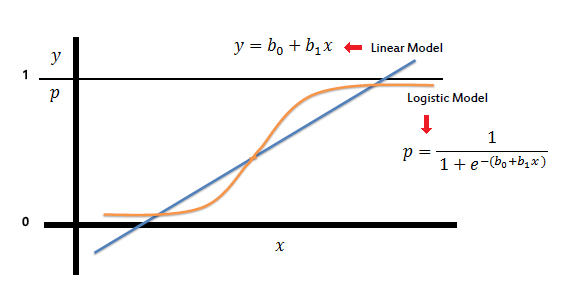

2025-05-16

::: {style="text-align: left;"}
**Zamora Thowinsson Jesús David**[^1]:<br> [info.thowinsson\@gmail.com](mailto:info.thowinsson@gmail.com)<br>Barranquilla, Colombia.
:::

[^1]: [*Jesús David Zamora Thowinsson*](https://es.overleaf.com/project/67fc8e737a504451f7115483). Economista y Administrador Público, Especialista en Estadística Aplicada, Candidato a Magíster Scientiarum en Gerencia Empresarial, Magíster en Estadística Aplicada.

```{=html}
<style>
  #TOC::before {
    content: "";
    display: block;
    width: 100%;
    background-image: url('Imagen_portada.png');
    background-size: cover;
    background-repeat: no-repeat;
    background-position: center;
    margin-bottom: 20px;
    border-radius: 10px;
    height: 350px; /* Ajusta la altura según tu imagen */
  }
</style>
```

::: {#toc-imagen-container}

:::

::: {style="text-align: justify;"}
**Economista** con Minor en Finanzas y **Administrador Público** de la Escuela Superior de Administración Pública (ESAP). **Especialista en Estadística Aplicada** de la Universidad del Atlántico, soy candidato a **Magíster Scientiarum en Gerencia Empresarial** por la Universidad Internacional de la URBE y **Magíster en Estadística Aplicada** en desarrollo por la Universidad del Norte.

Como **instructor en carrera administrativa del Servicio Nacional de Aprendizaje (SENA)**, me he consolidado como **experto en administración y análisis de bases de datos**, y en la aplicación de **análisis estadísticos y econométricos**. Poseo habilidades avanzadas en el manejo de softwares especializados como: **Statgraphics 18 - X64, R, Stata, SPSS – IBM, E-Views, Octave y Jamovi**. Además, soy **experto en Excel avanzado** y tengo dominio de herramientas de visualización de datos como **Power BI**.

Mi experiencia incluye la **formación y el desarrollo de talento** en áreas clave como **Negocios Internacionales, Gestión de Mercados, Dirección de Ventas y Procesos para la Comercialización Internacional**. También poseo competencias en el uso de lenguajes como **LaTeX y Markdown**, así como plataformas y entornos de desarrollo como **Quarto, Jupyter Notebook y Visual Studio Code**.
:::

::: {style="text-align: center;"}
**Abstract**
:::

::: {style="text-align: justify;"}
La asignatura Estadística I introduce al estudiante en los fundamentos teóricos y prácticos del análisis estadístico descriptivo. Su propósito es desarrollar en el alumno competencias básicas para recolectar, organizar, presentar, analizar e interpretar datos cuantitativos, con el fin de facilitar la toma de decisiones fundamentadas en evidencia.

Durante el curso se abordarán conceptos clave como población y muestra, tipos de variables, representaciones gráficas, medidas de tendencia central, dispersión y forma. Asimismo, se promoverá el uso de herramientas tecnológicas para la elaboración de gráficos y cálculos estadísticos, fomentando el pensamiento crítico y analítico en contextos reales.

Esta asignatura sienta las bases para cursos posteriores en estadística inferencial y análisis de datos, y es de aplicación transversal en distintas disciplinas, incluyendo las ciencias sociales, económicas, administrativas, de la salud e ingeniería.
:::

::: {style="text-align: center;"}
**Prefacio**
:::

# Notas de Clases

1.  My Presentations:
    1.  Presentación de Competencia [Clic Aquí](https://drive.google.com/file/d/1uvA5-Udr-HX7zh_5HX6BquzdpQ2ar37c/view)

# Softwares

1. R Studio [Click Aquí](https://posit.co/download/rstudio-desktop/)

2. R para Windows [Click Aquí](https://cran.r-project.org/bin/windows/base/)

3. R para Mac [Click Aquí](https://cran.r-project.org/bin/macosx/)

4. Visual Studio Code [Click](https://code.visualstudio.com/download)

5. Google Colad [Click Aquí](https://colab.google)

6. Posit Cloud [Click Aquí](https://posit.cloud/content/yours?sort=name_asc)

7. Geogebra [Clíck Aquí](https://www.geogebra.org/classic)

# Procesadores de Texto y Repositorios

1.  Latex [Click Aquí](https://es.overleaf.com/project)

2. Jupyter Book [Click Aquí](https://jupyterbook.org/en/stable/intro.html)

3. GitHub [Clic Aquí](https://github.com/jthowinsson?tab=stars)

4. Rpubs [Click Aquí](https://rpubs.com/j_zamoraTh)

# Estadística Básica

2.1. Estadística Descriptiva

2.2. Probabilidades

2.3. Distribución de Probabilidades

# Estadística Inferencial

3.0. Estadística inferencial (toc): Click aquí.

3.1. Distribución muestral: Click aquí.

3.2. Estimación: Click aquí.

3.3. Pruebas de hipótesis: Click aquí.

3.4. Análisis de datos categóricos: Click aquí.

3.5. Diseño de experimentos: Click aquí.

3.6. Regresión lineal: Click aquí.

